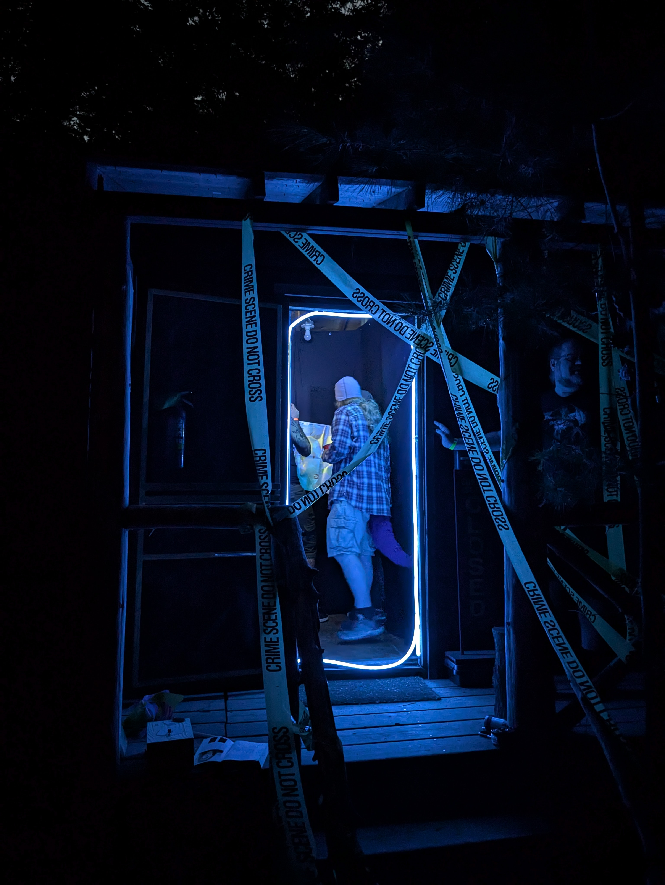
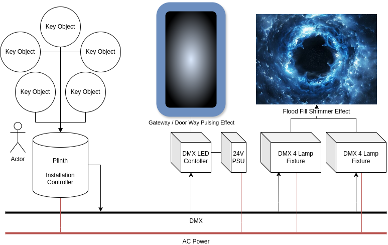

# Installation Contoller for Camp Feral Portal art piece.

A stand-alone art installation using RFID triggers and DMX lighting, running from a Raspberry Pi Pico

## Dependencies
- FastLED v3.7.3
- Pico-DMX
- SparkFun_Qwiic_RFID_Arduino_Library

## Reference Materials / Parts Used
- https://www.arduino.cc/reference/en/libraries/pico-dmx/
- https://github.com/jostlowe/Pico-DMX
- https://www.sparkfun.com/products/15209
- https://github.com/sparkfun/SparkFun_Qwiic_RFID_Arduino_Library
- https://cdn.sparkfun.com/assets/9/8/9/f/b/Qwiic_RFID_-_IDXXLA.pdf
- https://cdn.sparkfun.com/datasheets/Sensors/ID/ID-2LA,%20ID-12LA,%20ID-20LA2013-4-10.pdf
